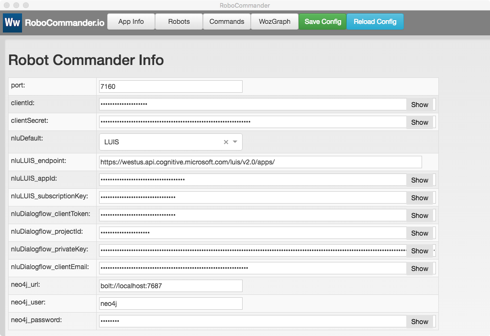
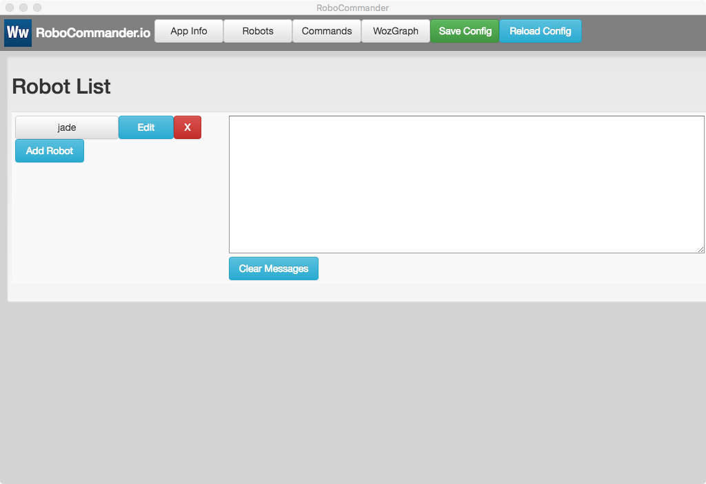
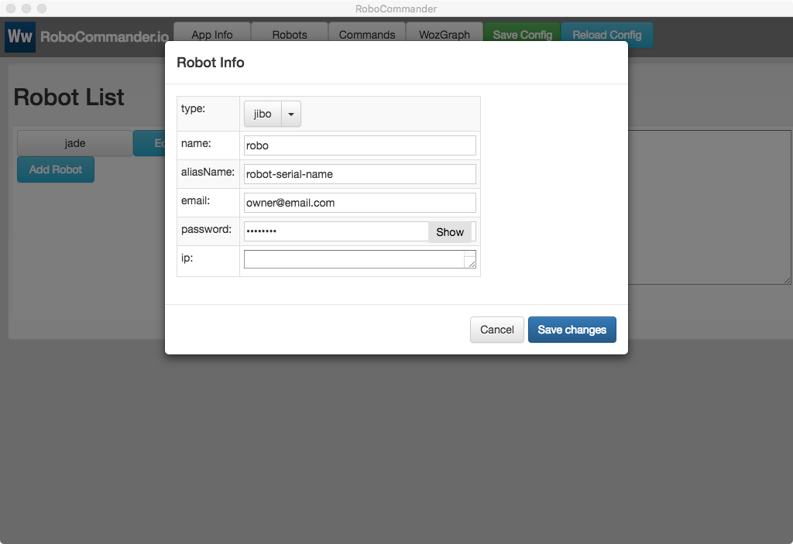
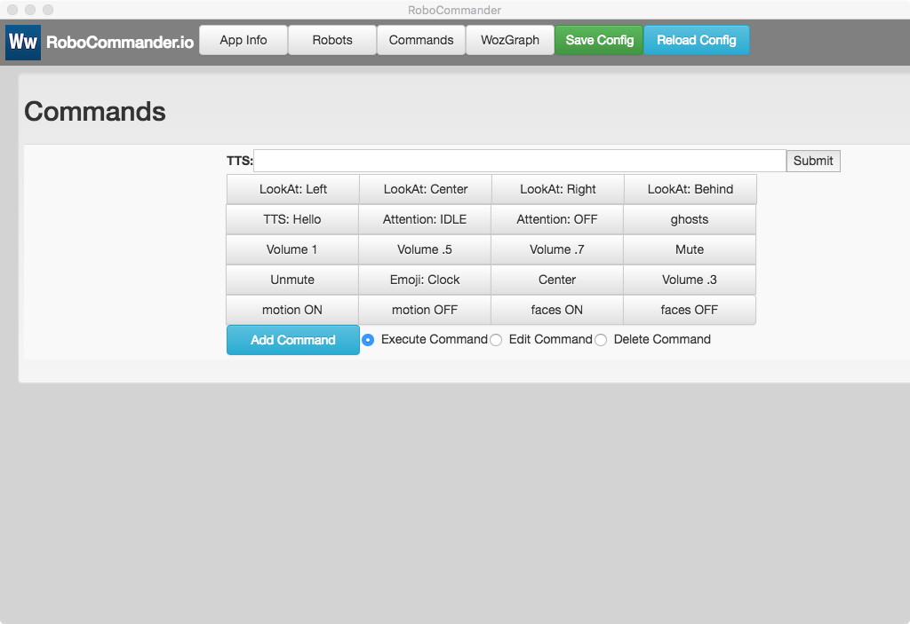
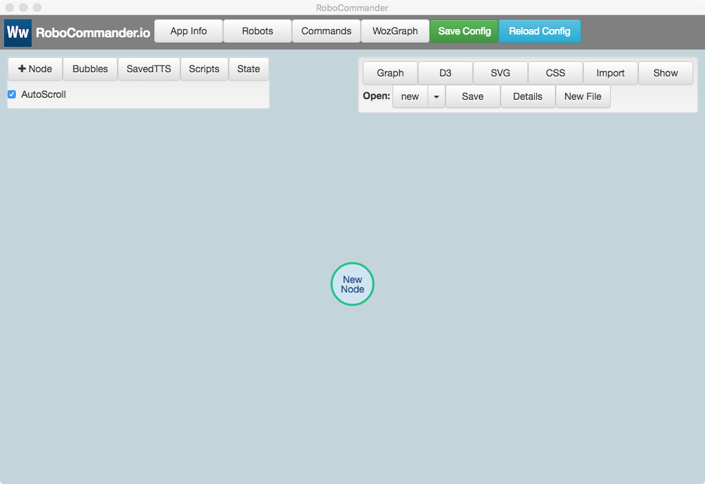
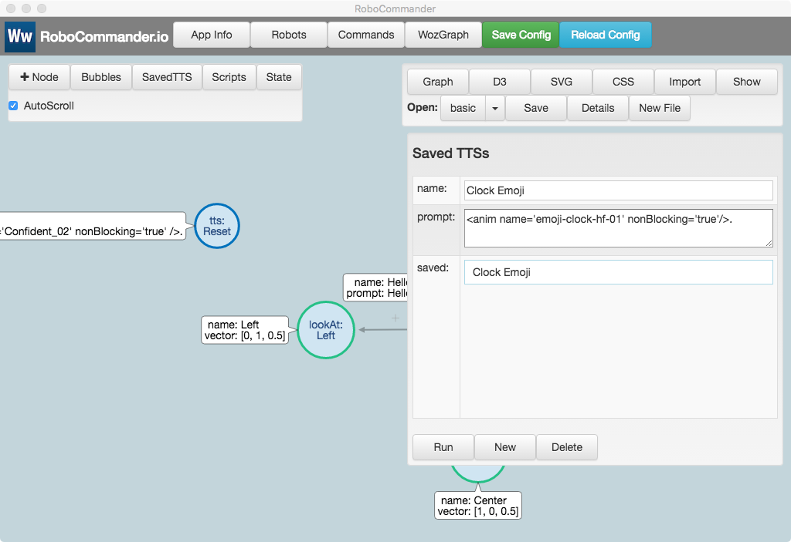
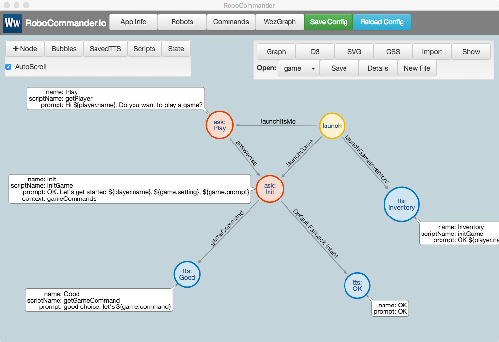
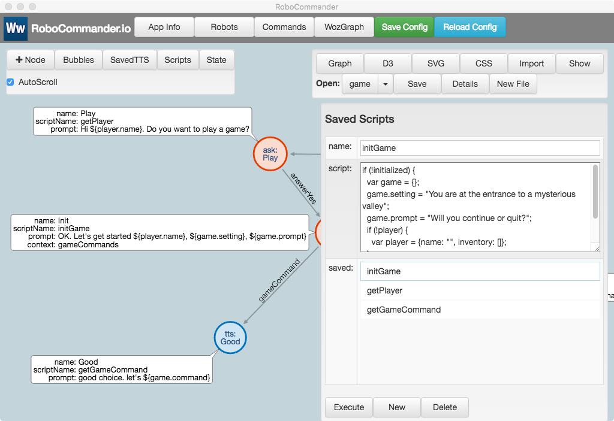
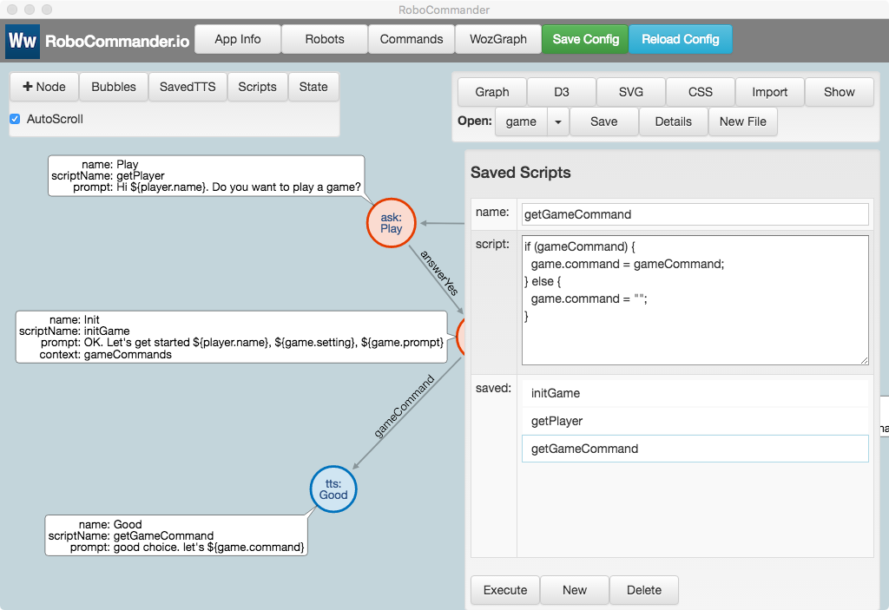
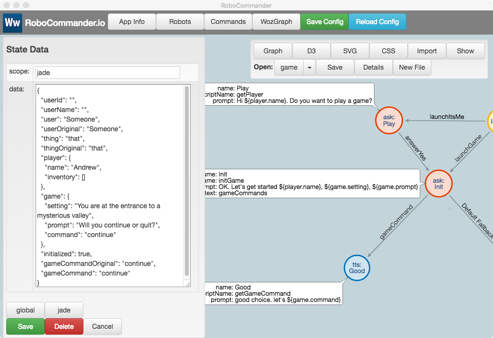

## RoboCommander

[https://wwlib.github.io/robocommander/](https://wwlib.github.io/robocommander/)

[https://wwlib.github.io](https://wwlib.github.io/)


RoboCommander is a tool for controlling robots. Any robot that implements a command protocol via a socket or REST API can potentially be controlled by RoboCommander (with appropriate modifications). The current version can control [robokit](https://wwlib.github.io/robokit/) robots and [Jibo](https://jibo.com/) robots (dev credentials are required).

RoboCommander is ideal for real-time, human-operated Woz (Wizard of Oz) remote control. In addition, RoboCommander’s WozGraph panel provides a graph-based tool for designing and controlling scripted interactions. WozGraph layouts can incorporate simple automation using  JavaScript. WozGraph layouts can be configured to respond automatically to voice commands via integration with LUIS and/or Dialogflow NLU services.

For developers, RoboCommander includes TypeScript classes that provide an easy way to prototype NLU-driven Remote Operation Mode (ROM) skills.

### Getting Started

#### Download

Download the Mac executable from https://wwlib.github.io/robot-commander/

#### Build

Building RoboCommander requires node v8.11.2 (or newer)

The use of the [yarn](https://yarnpkg.com/) package manager is **strongly** recommended, as opposed to using `npm`.

```bash
yarn
```

### Development Scripts

```bash
# run application in development mode
yarn dev

# compile source code and create webpack output
yarn compile

# `yarn compile` & create build with electron-builder
yarn dist

# `yarn compile` & create unpacked build with electron-builder
yarn dist:dir
```

### Setup

The RoboCommander tab bar is used to toggle the AppInfo, Robots, Commands and WozGraph panels. The developer credentials (clientId and clientSecret) required to connect to Jibo robots should be entered into the AppInfo panel.



Note: To use LUIS and/or Dialogflow NLU for WozGraph scripting and ROM skill development, their respective credential should be entered into the AppInfo panel.

### Robots

RoboCommander can control an arbitrary number of robots.



Add robots with the Add Robot button. Credentials for each robot are entered into the Robot Info panel.



Note: After adding robot info click the Save Config button.

Note: The ip field is read-only and display the ip address of a robot when it is connected.

To connect to a robot, click on its button in the Robot List. The connection process can take a few seconds and includes a number of steps. Status messages appear in the messages field.

When the connection succeeds, the robot’s button will turn dark blue. To disconnect from a robot, click its button again.

### Commands



Connected robots will appear on the Command panel as grey or dark blue buttons. Dark blue indicates that the robot is targeted. All targeted robots will receive any command that is sent via the command buttons and the tts field. Clicking on a robot’s button will toggle its targeted state. Un-targeted robots are still connected and can be re-targeted.

Clicking on a command button will send that command to all targeted robots.

Typing in the TTS (Text To Speech) field and clicking the Submit (hitting ENTER) button will generate a tts command and send it to the robot.

Commands can be added using the Add Command button. Commands can be edited by choosing Edit Command mode using the radio buttons. When Delete Command mode is enabled, command buttons will be deleted when clicked.


Note: To save any changes to the Command Panel, click on the Save Config button.

### WozGraph



The WozGraph panel provides a graph-based layout that can be used to organize command nodes for easy use in real-time Woz prototypes.

The simplest way to use the WozGraph is to create tts-type nodes. Typically, these nodes will have a name property which is optional, and a prompt property which is required. The prompt property can contain text and tts tags (i.e. ESML tags for Jibo robots).


Clicking on a node will generate a command and send it to all targeted robots.

Shift-Clicking on a node will open its editing panel


The lookAt node type can be used to control the orientation of the robot.


To save a layout, click on the Save button in the WozGraph file panel. To open a saved layout, select it from the Open pull-down list in the WozGraph file pane (top right)l.

WozGraph layouts are saved as json files. These can be shared and then imported using the Import button in the WozGraph file panel.

Note: The full json description of a layout can be accessed by clicking on the Graph button in the WozGraph file panel.

Note: A neo4j cypher representation of a WozGraph layout can be accessed by clicking on the cypher button in the WozGraph file panel. This cypher query can be pasted into the neo4j browser cypher field to reproduce the graph in neo4j.

### Saved TTS



### WozGraph Scripting

Limited scripting can be used in WozGraph layouts to generate dynamic prompts and to manage state throughout an interaction session. Scripts are referenced by name in the scriptName property of each node.

When a node’s scriptName property is defined, the named script will be executed before the node’s command is generated and sent to the robot(s).



Scripts are defined using the WozGraph Script panel.

Each robot has a stateObject which acts as the runtime context for scripts. Variables defined and modified by scripts are added to this context and can be evaluated dynamically in node prompts. For safety, WozGraph scripts are sandboxed and only have access to a robot’s stateObject context.

The initGame script in the game example layout defines two variables - game and player - in the robot’s stateObject script context. It also defines and sets an initialized flag so that initGame will only run once.



### NLU

When connected to an NLU service, RoboCommander will route all ASR (Automatic Speech Recognitions) events received by the robot to the specified NLU service. The intent and entities returned by NLU are automatically added to the robot’s stateObject script context and can then be referenced in WozGraph scripts.

If there is a launch-type node with a link type that corresponds to the received intent, the linked node will be invoked automatically.

For example: The LUIS agent in this example includes an intent called launchItsMe which matches utterances like: “It’s me, Andrew” or “I’m Andrew”. When LUIS recognizes an utterance like this, the returned intent is launchItsMe and the user entity is set to Andrew. These are automatically added to the stateObject for the robot. The getPlayer script looks for these values and sets the player.name accordingly. Then player.name can be dynamically evaluated in prompts like: “Hi ${player.name}. Do you want to play a game?”


Similarly, when the getGameCommand script is executed it looks for the gameCommand entity that accompanies gameCommand intent and uses it to set the game.command value. This is used to generate the dynamic prompt: “Good choice, let’s ${game.command}”



After running through the game example layout, the stateObject for the robot, jade, contains the accumulated state data generate by the scripts as well as the data added automatically when NLU results are received.



#### NLU - Hey Jibo, It’s me, Andrew

The NLU (LUIS) results logged in response to the prompt, “Hey Jibo, It’s me, Andrew” look like this:


```
It's me, Andrew
query:            It's me, Andrew
topScoringIntent:
  intent: launchItsMe
  score:  0.788159549
intents:
  -
    intent: launchItsMe
    score:  0.788159549
  -
    intent: launchUserLikes
    score:  0.02572859
  -
    intent: launchClock
    score:  0.009906115
  -
    intent: launchJoke
    score:  0.0074566165
  -
    intent: launchGameInventory
    score:  0.00698161731
  -
    intent: answerYes
    score:  0.006549847
  -
    intent: gameCommand
    score:  0.004054388
  -
    intent: launchGame
    score:  0.003993078
  -
    intent: None
    score:  0.0018267266
  -
    intent: answerNo
    score:  0.000809498364
  -
    intent: launchDoYouLike
    score:  0.0005564561
entities:
  -
    entity:     andrew
    type:       user
    startIndex: 9
    endIndex:   14
    resolution:
      values:
        - Andrew
```

#### NLU - Yes, I would love to

The NLU (LUIS) results logged in response to the prompt, “Yes, I would love to” look like this:

```
Yes, I would love to
query:            Yes, I would love to
topScoringIntent:
  intent: answerYes
  score:  0.213702753
intents:
  -
    intent: answerYes
    score:  0.213702753
  -
    intent: launchItsMe
    score:  0.0180373564
  -
    intent: launchJoke
    score:  0.01595323
  -
    intent: gameCommand
    score:  0.0127214622
  -
    intent: launchDoYouLike
    score:  0.0104755275
  -
    intent: launchClock
    score:  0.007906932
  -
    intent: launchGameInventory
    score:  0.00741183758
  -
    intent: launchGame
    score:  0.00418880861
  -
    intent: None
    score:  0.002662175
  -
    intent: launchUserLikes
    score:  0.000618771242
  -
    intent: answerNo
    score:  0.0004391634
entities:
  (empty array)
  ```

#### NLU - Let’s continue

 The NLU (LUIS) results logged in response to the prompt, “Let’s continue” look like this:

```
 Let’s continue
 query:            Let’s continue
 topScoringIntent:
   intent: gameCommand
   score:  0.905543745
 intents:
   -
     intent: gameCommand
     score:  0.905543745
   -
     intent: answerYes
     score:  0.0188934449
   -
     intent: launchGame
     score:  0.0145192379
   -
     intent: launchItsMe
     score:  0.012176482
   -
     intent: launchJoke
     score:  0.00691822451
   -
     intent: launchClock
     score:  0.00418823538
   -
     intent: launchDoYouLike
     score:  0.003716113
   -
     intent: launchGameInventory
     score:  0.00368323666
   -
     intent: answerNo
     score:  0.00365712564
   -
     intent: None
     score:  0.00256234314
   -
     intent: launchUserLikes
     score:  0.0009800107
 entities:
   -
     entity:     continue
     type:       gameCommand
     startIndex: 6
     endIndex:   13
     resolution:
       values:
         - continue
```

### ROM Skills - remote operation mode (romulus)

The example classes in the `src/romulus` folder demonstrate how to implement simple Remote Operation Mode (ROM) skills.

`src/romulus/Hub.ts`

A Hub is instantiated for each robot and manages the life cycle of ROM skills that are triggered by ASR/NLU (speech) interactions with the robot.

`src/romulus/Skill.ts`

Skill is an abstract class that defines the implementation interface for ROM skills.

`src/romulus/NLUController.ts`

NLUController is an abstract class that defines the implementation interface for NLU controllers including LUIS, Dialogflow V1 and Dialogflow V2

`src/romulus/ClockSkill.ts`

ClockSkill is a simple ROM skill that generates a TTS answer when an utterance like “Hey, Jibo. What time is it” is heard by the robot.

#### RoboCommander Core Classes

The classes in the src/model folder are RoboCommander’s core classes.

`src/mode/Robot.ts`

The Robot class is instantiated for each robot. It manages the connection to the robot, receives updates from the robot and sends commands to the robot.

The Robot class’s sendCommand() method is used to turn command metadata from the React UI into robot-friendly API calls.

The Robot class instantiates a Hub (an instance of src/romulus/Hub.ts) that manages the life cycle of Rom skills that are triggered by ASR/NLU (speech) interactions with the robot.

`src/model/RomCommand.ts`

The RomCommand class is a container for command metadata which is used for saving/loading commands and for displaying command buttons in the React UI. RomCommand instances are parsed and sent to the robot via the Robot class’s sendCommand() method.


### Summary

RoboCommander is a flexible tool for real time Woz prototyping. It also provides a simple framework for implementing automated, interactive, NLU-driven prototypes that utilize the robot’s socket/REST command API.
